# Project Blueprint: MovieMind

## Table of Contents

1. [Executive Summary](#executive-summary)
2. [Tech Stack](#tech-stack)
3. [Architecture Overview](#architecture-overview)
4. [Directory Map](#directory-map)
5. [Data Model](#data-model)
6. [API Surface](#api-surface)
7. [End-to-End Flows](#end-to-end-flows)
8. [Security Architecture](#security-architecture)
9. [Performance Analysis](#performance-analysis)
10. [Code Quality Findings](#code-quality-findings)
11. [Deployment & Operations](#deployment--operations)
12. [Glossary](#glossary)

---

## Executive Summary

**MovieMind** is a full-stack movie and TV recommendation platform built with Next.js 15. It aggregates content from TMDB (The Movie Database), enriches discovery with Google Gemini AI, and provides personalized user experiences through favorites, watchlists, viewing history, and AI-powered recommendations.

**Target Users:** Movie enthusiasts seeking discovery, tracking, and personalized recommendations.

**Core Features:**
- Browse trending, top-rated, and popular movies/TV shows
- AI-powered chat assistant for movie recommendations
- Personalized recommendations based on user preferences
- Favorites and watchlist management
- Viewing history tracking
- Mood-based and time-based movie discovery
- Celebrity browsing
- Admin dashboard with user management and cache controls

**Current State:** Production-grade application with extensive security hardening (CSP, rate limiting, input validation, RBAC). Multiple security audit reports indicate iterative hardening over time.

---

## Tech Stack

| Category | Technology | Version | Purpose |
|----------|-----------|---------|---------|
| **Runtime** | Next.js | 15.5.4 | React framework (App Router) |
| **Language** | TypeScript | 5.x | Type safety |
| **UI** | React | 18.3.1 | Component library |
| **Styling** | Tailwind CSS | 3.4.17 | Utility-first styling |
| **UI Primitives** | Radix UI | Various | Accessible components |
| **Icons** | Lucide React | 0.454.0 | Icon library |
| **Database** | MongoDB | 6.13.0 | Primary data store |
| **ODM** | Mongoose | 8.24.3 | Schema modeling |
| **Cache** | Redis | 4.7.0 | Optional caching layer |
| **Auth** | NextAuth.js | 4.24.11 | Google OAuth |
| **Validation** | Zod | 3.24.1 | Schema validation |
| **Testing** | Vitest | 3.2.7 | Unit/integration tests |
| **Charts** | Recharts | 2.15.0 | Admin dashboard charts |
| **Notifications** | Sonner / react-hot-toast | 1.7.1 / 2.5.2 | Toast notifications |

**External Services:**
| Service | Purpose | Required |
|---------|---------|----------|
| TMDB API | Movie/TV data | Yes |
| Google Gemini AI | Chat & recommendations | Optional |
| Google OAuth | Authentication | Yes |

---

## Architecture Overview

### High-Level Architecture

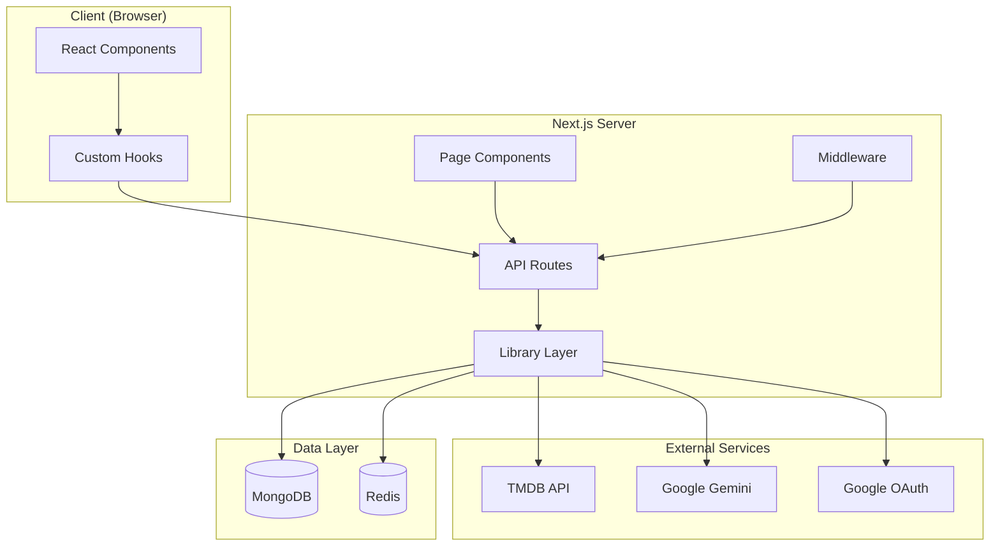

### Request Lifecycle

```mermaid
sequenceDiagram
    participant C as Client
    participant MW as Middleware
    participant API as API Route
    participant AUTH as Auth Layer
    participant LIB as Library
    participant DB as Database
    participant EXT as External API

    C->>MW: HTTP Request
    MW->>MW: Feature flag check
    MW->>MW: Auth check (token)
    alt Unauthorized & protected
        MW-->>C: 302/401
    end
    MW->>API: Forward request
    API->>AUTH: requireSession/requireAdmin
    alt Auth failed
        AUTH-->>C: 401/403
    end
    API->>API: Rate limit check
    API->>API: Zod validation
    API->>LIB: Business logic
    LIB->>DB: Query
    DB-->>LIB: Result
    LIB->>EXT: External call (optional)
    EXT-->>LIB: Response
    LIB-->>API: Processed data
    API-->>C: JSON Response
```

### Middleware Pipeline

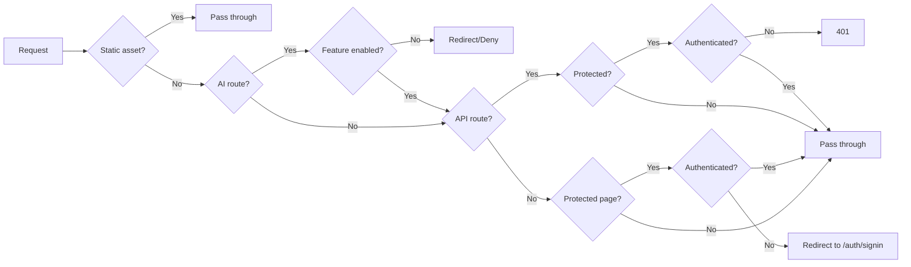

---

## Directory Map

### Root Configuration Files

| File | Purpose |
|------|---------|
| `package.json` | Dependencies, scripts, project metadata |
| `next.config.mjs` | Next.js config with CSP headers, image settings |
| `tsconfig.json` | TypeScript strict mode, path aliases (`@/*`) |
| `.env.example` | Environment variable reference template |
| `middleware.ts` | Auth, feature-flag, and route protection |
| `tailwind.config.ts` | Custom theme, animations, typography |
| `eslint.config.mjs` | ESLint rules (Next.js defaults) |
| `vitest.config.mts` | Test configuration |

### `app/` — Next.js App Router

#### Pages (Routes)

| Path | File | Purpose |
|------|------|---------|
| `/` | `app/page.tsx` | Home: trending, popular, genres, personalized sections |
| `/ai-assistant` | `app/ai-assistant/page.tsx` | AI chat interface |
| `/celebrities` | `app/celebrities/page.tsx` | Browse popular celebrities |
| `/favorites` | `app/favorites/page.tsx` | User favorites grid |
| `/genres` | `app/genres/page.tsx` | Browse all genres |
| `/movie/[id]` | `app/movie/[id]/page.tsx` | Movie details with AI similar |
| `/tv/[id]` | `app/tv/[id]/page.tsx` | TV show details |
| `/top-rated` | `app/top-rated/page.tsx` | Top-rated movies & TV |
| `/trending` | `app/trending/page.tsx` | Trending content |
| `/watchlist` | `app/watchlist/page.tsx` | User watchlist |
| `/profile` | `app/profile/page.tsx` | Profile, history, privacy settings |
| `/privacy` | `app/privacy/page.tsx` | Public privacy policy |
| `/admin` | `app/admin/page.tsx` | Admin dashboard |

#### API Routes (`app/api/`)

**Public (TMDB Proxy):**
| Endpoint | Methods | Purpose |
|----------|---------|---------|
| `/api/movies` | GET | Popular + top-rated + genres |
| `/api/movies/top-rated` | GET | Top-rated movies |
| `/api/movies/time-based` | GET | Movies by duration |
| `/api/trending` | GET | Trending content |
| `/api/trending/movie` | GET | Trending movies by window |
| `/api/trending/tv` | GET | Trending TV by window |
| `/api/genres` | GET | All movie genres |
| `/api/genre/[id]` | GET | Genre details + movies |
| `/api/movie/[id]` | GET | Movie details |
| `/api/movie/[id]/ai-similar` | GET | AI-similar movies |
| `/api/tv/[id]` | GET | TV show details |
| `/api/tv/top-rated` | GET | Top-rated TV shows |
| `/api/actor/[id]` | GET | Actor/person details |
| `/api/celebrities` | GET | Popular celebrities |
| `/api/search` | GET | Search movies/TV |
| `/api/trailers` | GET | Movies with trailers |
| `/api/mood-recommendations` | GET | Movies by mood |
| `/api/features` | GET | Feature flags |
| `/api/health/live` | GET | Liveness probe |
| `/api/health/ready` | GET | Readiness probe |

**Authenticated (User Data):**
| Endpoint | Methods | Purpose |
|----------|---------|---------|
| `/api/favorites` | GET, POST, DELETE | Manage favorites |
| `/api/watchlist` | GET, POST, DELETE | Manage watchlist |
| `/api/history` | GET, POST, DELETE | Viewing history |
| `/api/chat` | POST | Chat with Gemini AI |
| `/api/ai-recommendations` | POST | AI personalized recommendations |
| `/api/chat-history` | GET | List chat sessions |
| `/api/chat-history/[id]` | GET, DELETE | Chat session detail |
| `/api/user` | GET | Current user data |
| `/api/user/account` | DELETE | Delete account |
| `/api/user/export` | GET | Export user data |

**Admin:**
| Endpoint | Methods | Purpose |
|----------|---------|---------|
| `/api/admin/stats` | GET | System statistics |
| `/api/admin/users` | GET, PATCH | User management |
| `/api/admin/settings` | GET, PUT | Feature settings |
| `/api/admin/cache` | GET, POST | Cache management |

**Auth:**
| Endpoint | Purpose |
|----------|---------|
| `/api/auth/[...nextauth]` | NextAuth handlers |

### `lib/` — Core Library

| File | Purpose |
|------|---------|
| `auth.ts` | NextAuth configuration, Google provider, JWT callbacks |
| `mongodb.ts` | MongoDB connection with global caching |
| `redis.ts` | Redis client with health monitoring |
| `redis-config.ts` | Redis configuration builder |
| `redis-health.ts` | Redis health tracking, circuit breaker |
| `cache.ts` | RedisCache class with memory fallback, stampede protection |
| `cache-namespace.ts` | Cache key namespacing utilities |
| `cacheManager.ts` | High-level cache management |
| `env.ts` | Environment validation with Zod |
| `security/auth.ts` | `requireSession`, `requireUser`, `requireAdmin`, `requireOwner` |
| `security/rateLimit.ts` | Rate limiting with Redis + memory fallback |
| `security/schemas.ts` | Zod validation schemas |
| `ai-security.ts` | AI URL validation, JSON extraction, error mapping |
| `gemini-payload.ts` | Gemini API payload builders |
| `ai-markdown.tsx` | Safe Markdown renderer for AI output |
| `fetchWithRetry.ts` | Enhanced fetch with retry + timeout |
| `privacy-service.ts` | User data export |
| `privacy-retention.ts` | Retention policy helpers |
| `account-deletion.ts` | Account deletion with owner protection |
| `tmdb.ts` | TMDB API helpers |
| `utils.ts` | Miscellaneous utilities |

### `lib/models/` — Mongoose Models

| File | Model | Collection |
|------|-------|------------|
| `User.ts` | User | `users` |
| `Movie.ts` | Movie | `movies` |
| `Rating.ts` | Rating | `ratings` |
| `ChatHistory.ts` | ChatHistory | `chat_histories` |
| `History.ts` | History | `histories` |
| `FavoritesModel.ts` | Favorites | `favorites` |
| `WatchlistModel.ts` | Watchlist | `watchlists` |
| `index.ts` | Barrel export | — |

### `components/` — UI Components

**Primitives (`components/ui/`):** 30+ shadcn/ui-style components (button, dialog, form, tabs, etc.)

**Feature Components:**
| Component | Purpose |
|-----------|---------|
| `ChatAssistant.tsx` | AI chat interface |
| `SearchBar.tsx` | Global search input |
| `AuthButton.tsx` | Google sign-in/out |
| `FavoriteButton.tsx` | Add/remove favorites |
| `GridItemCard.tsx` | Grid item display |
| `MovieTrailer.tsx` | YouTube trailer embed |
| `SafeYouTubeEmbed.tsx` | Validated YouTube embed |
| `TrendingSection.tsx` | Trending content carousel |
| `TopRatedMovies.tsx` | Top-rated display |
| `Watchlist.tsx` | Watchlist management |

**Layout Components:**
| Component | Purpose |
|-----------|---------|
| `layout/FeatureNavItems.tsx` | Nav items with feature flags |
| `AdminNavLink.tsx` | Admin-only nav link |
| `home/LatestTrailers.tsx` | Home trailers section |
| `home/PopularMovies.tsx` | Home popular movies |

**Admin Components:**
| Component | Purpose |
|-----------|---------|
| `admin/CacheManagement.tsx` | Cache stats & controls |
| `admin/DashboardOverview.tsx` | Dashboard stats |
| `admin/SystemSettings.tsx` | Feature toggles |
| `admin/UserManagement.tsx` | User list & roles |

### `hooks/` — Custom React Hooks

| Hook | Purpose |
|------|---------|
| `useFavorites.ts` | Favorites state management |
| `useWatchlist.ts` | Watchlist state management |
| `useFeatures.ts` | Feature flag checking |
| `useDebounce.ts` | Debounce utility |
| `useInfiniteScroll.ts` | Infinite scroll |
| `use-mobile.tsx` | Mobile detection |
| `use-toast.ts` | Toast notifications |

### `scripts/` — Operator Tools

| Script | Purpose |
|--------|---------|
| `setupDatabase.cts` | Database setup (destructive) |
| `promote-owner.js` | CLI to promote user to owner |
| `testRedisConnection.ts` | Test Redis connectivity |
| `download-genre-images.js` | Download genre backdrop images |

### `types/` — Type Definitions

| File | Purpose |
|------|---------|
| `gemini.ts` | Gemini API response types |
| `next-auth.d.ts` | NextAuth module augmentation |

### `tests/` — Security Tests

All security-focused tests using Vitest:
- `ai-browser-security.test.ts` — AI prompt injection tests
- `ai-markdown-security.test.tsx` — XSS protection tests
- `chat-trust-boundary.test.ts` — Chat trust boundary tests
- `operational-security.test.ts` — Operational security tests
- `privacy-account-security.test.ts` — Account deletion privacy tests
- `promote-users-security.test.ts` — Owner promotion security tests
- `redis-cache-security.test.ts` — Redis cache security tests
- `user-security.test.ts` — Auth/authorization tests

---

## Data Model

### Entity Relationship

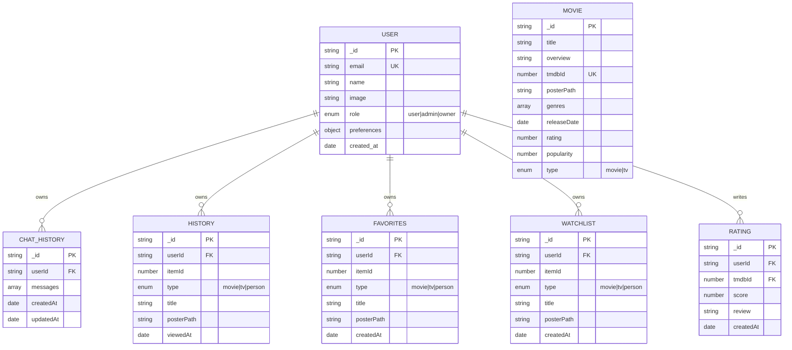

### Schema Details

#### User (`lib/models/User.ts`)
```typescript
{
  email: string (required, unique)
  name?: string
  image?: string
  role: 'user' | 'admin' | 'owner' (default: 'user')
  preferences: {
    favorite_genres: string[]
    selected_moods: string[]
    historyTrackingEnabled: boolean (default: true)
  }
  created_at: Date
}
```

#### ChatHistory (`lib/models/ChatHistory.ts`)
```typescript
{
  userId: string (required)
  messages: [{
    role: 'user' | 'assistant'
    content: string (required)
    timestamp: Date
  }]
  createdAt: Date
  updatedAt: Date
}
```
- **Retention:** Bounded to 200 messages per chat (`$slice: -200`)
- **Environment config:** `CHAT_RETENTION_DAYS` (default 365)

#### History (`lib/models/History.ts`)
```typescript
{
  userId: string (required)
  itemId: number (required)
  type: 'movie' | 'tv' | 'person'
  title: string (required)
  posterPath: string | null
  viewedAt: Date (default: now)
}
```
- **Index:** Unique compound `{ userId, itemId, type }`
- **Retention:** `HISTORY_RETENTION_DAYS` (default 180)

#### Favorites (`lib/models/FavoritesModel.ts`)
```typescript
{
  userId: string (required)
  itemId: number (required)
  type: 'movie' | 'tv' | 'person'
  title: string
  posterPath: string | null
  createdAt: Date
}
```
- **Upsert pattern:** `findOneAndUpdate` with `upsert: true`

#### Watchlist (`lib/models/WatchlistModel.ts`)
Same structure as Favorites.

#### Movie (`lib/models/Movie.ts`)
```typescript
{
  title: string (required)
  overview: string (required)
  tmdbId: number (required, unique)
  posterPath: string
  genres: string[]
  releaseDate: Date
  rating: number
  popularity: number
  type: 'movie' | 'tv'
}
```
- **Timestamps:** `true` (adds `createdAt`, `updatedAt`)

#### Rating (`lib/models/Rating.ts`)
```typescript
{
  userId: string (required)
  tmdbId: number (required)
  score: number (1-10)
  review: string
  createdAt: Date
}
```

---

## API Surface

### Authentication

| Mechanism | Implementation |
|-----------|---------------|
| Provider | Google OAuth 2.0 |
| Session Strategy | JWT (30-day maxAge) |
| Cookies | `__Secure-next-auth.*` (httpOnly, SameSite=lax, secure in prod) |
| CSRF | `__Host-next-auth.csrf-token` |

### Authorization Roles

| Role | Capabilities |
|------|-------------|
| `user` | Own data (favorites, watchlist, history, chat) |
| `admin` | All user capabilities + user management, cache management, stats |
| `owner` | All admin capabilities + account deletion protection bypass |

### Rate Limits (`lib/security/rateLimit.ts`)

| Key | Limit | Window | Scope |
|-----|-------|--------|-------|
| `chat` | 10 | 60s | Per-user |
| `aiRecommendations` | 5 | 60s | Per-user |
| `aiSimilar` | 10 | 60s | Per-user |
| `search` | 30 | 60s | Per-IP |
| `tmdbProxy` | 60 | 60s | Per-IP |
| `mood` | 20 | 60s | Per-IP |
| `auth` | 10 | 60s | Per-IP |
| `adminMutation` | 30 | 60s | Per-user |
| `userExport` | 5 | 5min | Per-user |
| `accountDelete` | 2 | 5min | Per-user |

### Request Validation

All input validated with Zod schemas (`lib/security/schemas.ts`):
- `.strict()` on all object schemas (rejects unknown fields)
- Max length bounds on all strings
- Positive integer validation for IDs
- No `$` operators or dotted keys allowed

### Content Security Policy

```http
Content-Security-Policy:
  default-src 'self';
  script-src 'self';
  style-src 'self' 'unsafe-inline';
  img-src 'self' data: https://image.tmdb.org https://lh3.googleusercontent.com;
  frame-src https://www.youtube-nocookie.com;
  connect-src 'self'
```

---

## End-to-End Flows

### 1. User Sign-In Flow

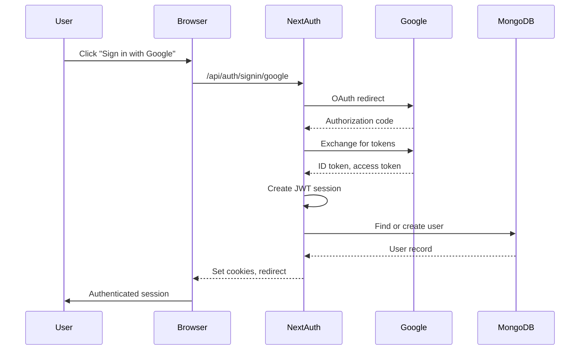

**Key Files:**
- `lib/auth.ts` (lines 23-163): `authOptions` configuration
- `middleware.ts` (lines 58-95): Route protection

### 2. Movie Discovery Flow

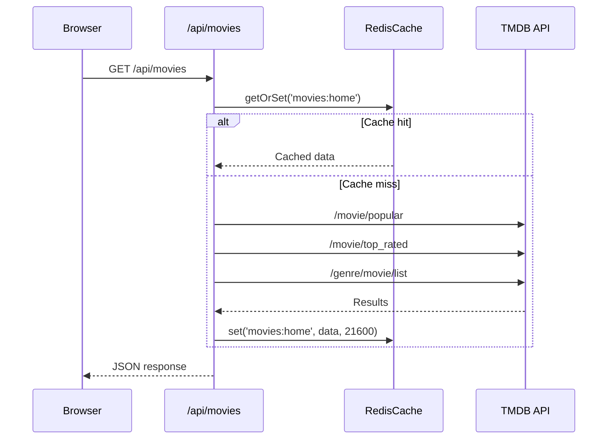

**Key Files:**
- `app/api/movies/route.ts`
- `lib/cache.ts` (lines 288-334): `getOrSet` with stampede protection

### 3. AI Chat Flow

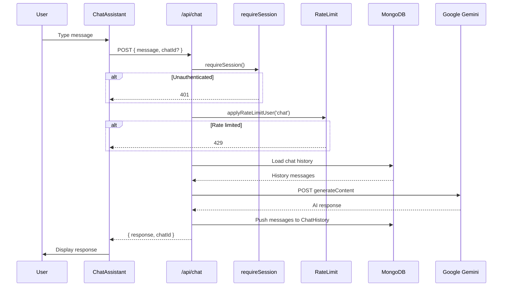

**Key Files:**
- `app/api/chat/route.ts` (full file)
- `lib/gemini-payload.ts`: Payload construction
- `lib/ai-security.ts`: URL validation, error handling

### 4. Favorites Management Flow

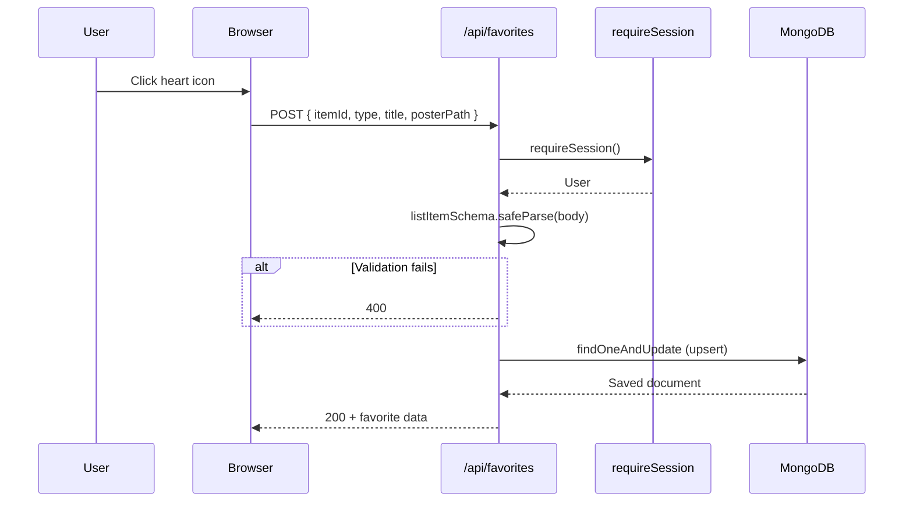

**Key Files:**
- `app/api/favorites/route.ts`
- `lib/security/schemas.ts` (lines 36-43): `listItemSchema`

### 5. Admin User Management Flow

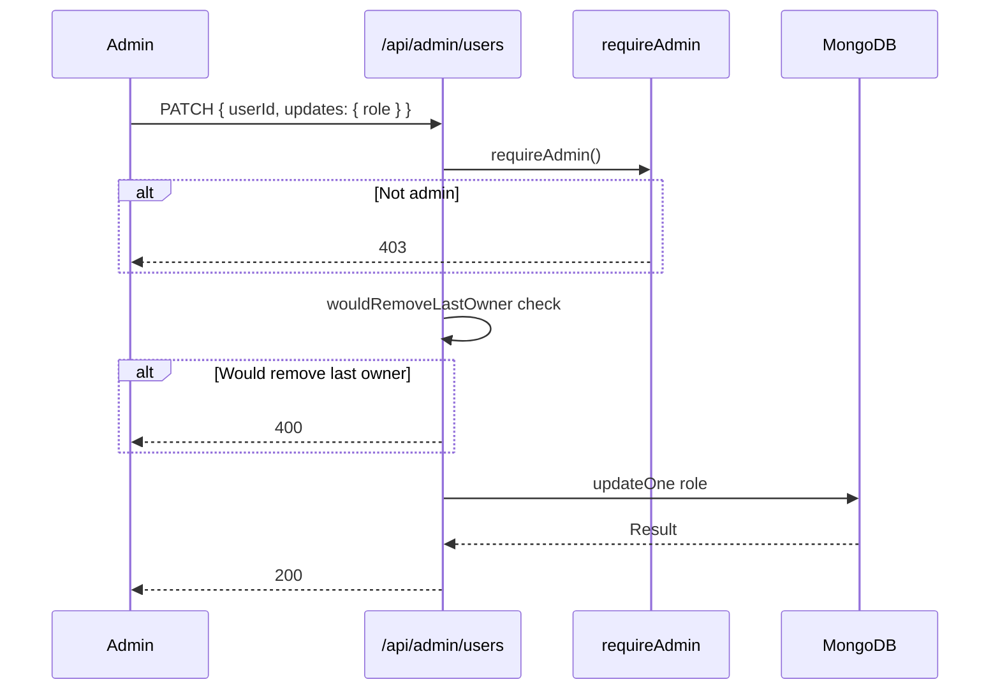

**Key Files:**
- `app/api/admin/users/route.ts`
- `lib/security/auth.ts` (lines 197-217): `wouldRemoveLastOwner`

---

## Security Architecture

### Defense-in-Depth Layers

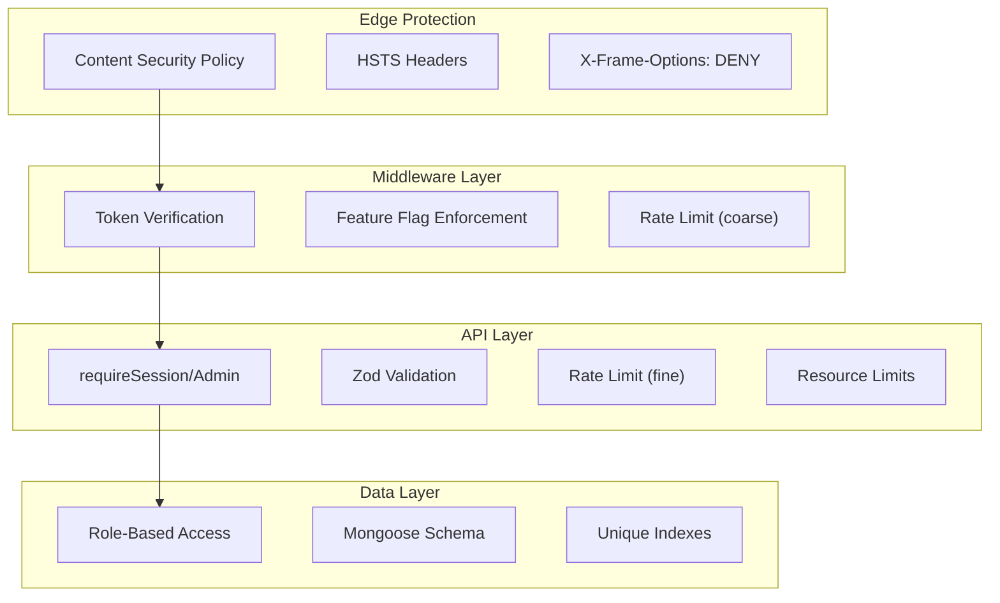

### Key Security Controls

| Control | Implementation | Location |
|---------|---------------|----------|
| **Authentication** | NextAuth + Google OAuth | `lib/auth.ts` |
| **Authorization** | `requireSession/User/Admin/Owner` | `lib/security/auth.ts` |
| **Input Validation** | Zod `.strict()` schemas | `lib/security/schemas.ts` |
| **Rate Limiting** | Redis + memory fallback | `lib/security/rateLimit.ts` |
| **Cache Isolation** | Key namespacing | `lib/cache-namespace.ts` |
| **Prompt Injection** | System instruction hardening | `lib/gemini-payload.ts` |
| **XSS Prevention** | React escaping, CSP | `next.config.mjs` |
| **CSRF** | SameSite cookies, CSRF token | `lib/auth.ts` |
| **NoSQL Injection** | Schema validation, no raw queries | All API routes |
| **Mass Assignment** | `.strict()` Zod schemas | `lib/security/schemas.ts` |

### Secrets Management

| Secret | Source | Usage |
|--------|--------|-------|
| `NEXTAUTH_SECRET` | Env | JWT signing |
| `GOOGLE_CLIENT_ID` | Env | OAuth |
| `GOOGLE_CLIENT_SECRET` | Env | OAuth |
| `GOOGLE_API_KEY` | Env | Gemini (passed via header, never URL) |
| `TMDB_API_KEY` | Env | TMDB API |
| `MONGODB_URI` | Env | Database |
| `REDIS_URL`/`REDIS_*` | Env | Cache |

**Note:** `GOOGLE_API_KEY` is sent via `x-goog-api-key` header, never in URL query params.

### AI Security (`lib/ai-security.ts`)

- **URL Validation:** HTTPS-only, no credentials, no control chars
- **YouTube Embed:** 11-char video ID validation
- **Prompt Injection Defense:** System instructions, "UNTRUSTED_" data prefixing
- **Output Limiting:** Max response length 4000 chars
- **Fenced JSON Extraction:** Bounded parsing for structured output

---

## Performance Analysis

### Caching Strategy

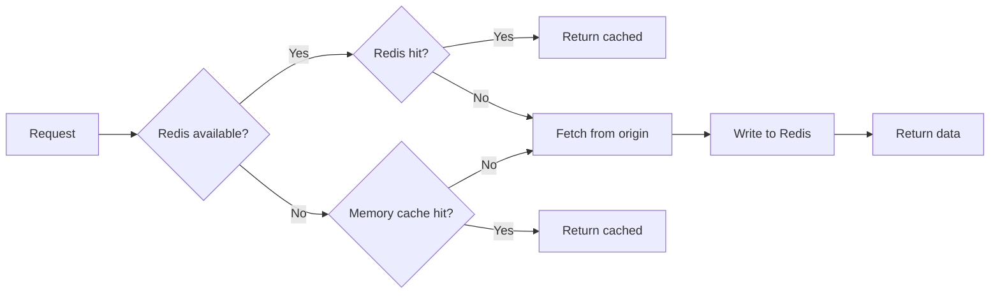

**Cache Layers:**
1. **Redis** (primary): Shared across instances, 1h default TTL
2. **In-Memory** (fallback): Per-instance, 5000 entry limit, LRU eviction

**Key Patterns:**
- `getOrSet` with in-flight deduplication (stampede protection)
- Bounded SCAN for key iteration (never `KEYS`)
- Namespace isolation (`security:rate-limit:` vs `app:cache:`)

### Identified Bottlenecks

| Issue | Location | Impact | Recommendation |
|-------|----------|--------|----------------|
| No MongoDB indexing on frequent queries | `lib/models/*.ts` | Slow user data fetches | Add compound indexes for `{ userId, createdAt }` |
| Memory cache cleanup interval | `lib/cache.ts:27-28` | Stale entries accumulate | Consider shorter cleanup window |
| Chat history unbounded growth | `app/api/chat/route.ts:171` | Document size creep | `$slice: -200` mitigates; consider TTL |
| No response compression | `next.config.mjs` | Larger payloads | Enable `compress: true` (default in prod) |
| Sequential session + user lookup | `lib/auth.ts:91-97` | Double DB hit on session | Cache role in JWT, refresh on change |

### Scalability Considerations

- **Stateless:** JWT sessions enable horizontal scaling
- **Redis:** Shared cache across instances
- **MongoDB Connection:** Pooled via global cache in `lib/mongodb.ts`
- **Rate Limiting:** Redis-backed for cross-instance consistency

---

## Code Quality Findings

### Strengths

| Aspect | Evidence |
|--------|----------|
| **Security-first** | 8+ security test files, multiple audit reports |
| **Input validation** | Zod `.strict()` on all API boundaries |
| **Error handling** | Structured errors, no silent failures |
| **Role re-validation** | `requireUser` fetches fresh role from DB |
| **Cache safety** | No `FLUSHDB`, bounded SCAN, namespace isolation |
| **AI hardening** | Prompt injection defenses, URL validation |

### Issues & Recommendations

| Issue | Location | Severity | Recommendation |
|-------|----------|----------|----------------|
| **Unused fields** | `Movie.ts:10-12` (rating, popularity) | Low | Remove unused schema fields or implement |
| **Missing indexes** | All models except `History.ts` | Medium | Add indexes for common queries |
| **Test coverage** | Only security tests exist | Medium | Add unit tests for business logic |
| **Rate limit IP trust** | `rateLimit.ts:76-89` | Low | Document reliance on `x-forwarded-for` |
| **Console.error in auth** | `auth.ts:54,117,84` | Low | Use structured logger |
| **Hardcoded limits** | Various magic numbers | Low | Extract to config/constants |

### Dead Code

| File | Status |
|------|--------|
| `lib/prisma.ts` | Deleted (marked as `D` in git status) |
| `lib/db.ts` | Deleted |
| `lib/dbUtils.ts` | Deleted |
| `lib/settings.ts` | Deleted |
| `lib/models/Movie.ts` | Exists but `rating`/`popularity` unused |
| `app/redis-demo/` | Deleted |
| `app/api/redis-example/` | Deleted |
| `app/api/favorites/enhanced-details/` | Deleted |
| `app/api/watchlist/enhanced-details/` | Deleted |

---

## Deployment & Operations

### Environment Variables

**Required:**
```
MONGODB_URI=mongodb+srv://...
TMDB_API_KEY=...
GOOGLE_CLIENT_ID=...
GOOGLE_CLIENT_SECRET=...
NEXTAUTH_SECRET=... (32+ chars)
NEXTAUTH_URL=https://your-domain.com
```

**Optional:**
```
GOOGLE_API_KEY=... (enables AI features)
REDIS_URL=redis://... (falls back to memory cache)
REDIS_HOST/REDIS_PORT/REDIS_USERNAME/REDIS_PASSWORD
HISTORY_RETENTION_DAYS=180 (1-3650)
CHAT_RETENTION_DAYS=365 (1-3650)
```

### Build & Deploy

```bash
# Development
npm run dev

# Production build
npm run build

# Start production server
npm run start

# Verification pipeline
npm run verify  # lint + typecheck + test + build

# Database setup (destructive - use with caution)
npm run setup-db

# Test Redis connection
npm run test-redis
```

### Health Checks

| Endpoint | Purpose | Expected Response |
|----------|---------|-------------------|
| `GET /api/health/live` | Liveness | `{ status: 'ok' }` |
| `GET /api/health/ready` | Readiness | `{ status: 'ok', config: {...} }` |

### Monitoring Suggestions

- **Uptime:** Ping `/api/health/live` every 30s
- **Readiness:** Check `/api/health/ready` before routing traffic
- **Redis:** Monitor `redisHealth` state via admin cache endpoint
- **MongoDB:** Track connection pool size and query times
- **Rate Limits:** Alert on 429 spike patterns

### CI/CD (`.github/workflows/ci.yml`)

The repository includes GitHub Actions workflow for continuous integration. Expected checks:
- ESLint
- TypeScript typecheck
- Vitest test suite
- Next.js build

### Dependabot (`.github/dependabot.yml`)

Automated dependency updates configured for npm ecosystem.

---

## Glossary

| Term | Definition |
|------|------------|
| **TMDB** | The Movie Database — external API for movie/TV metadata |
| **Gemini** | Google's AI model (gemini-2.0-flash) for chat and recommendations |
| **NextAuth** | Authentication library for Next.js |
| **RBAC** | Role-Based Access Control (user, admin, owner) |
| **Stampede Protection** | Deduplication of concurrent cache-miss fetches |
| **CSP** | Content Security Policy — HTTP header restricting resource loading |
| **HSTS** | HTTP Strict Transport Security |
| **LRU** | Least Recently Used — cache eviction policy |
| **ODM** | Object Document Mapper (Mongoose for MongoDB) |
| **TTL** | Time To Live — cache entry expiration |
| **PKCE** | Proof Key for Code Exchange — OAuth security extension |
| **CSRF** | Cross-Site Request Forgery |

---

## Mental Model

### How to Think About This Codebase

1. **Server-First Architecture:** All data fetching happens server-side. Pages render on the server, API routes handle mutations. The client only renders what the server provides.

2. **Security at Every Layer:** Defense-in-depth is the core philosophy. Middleware is defense-in-depth only — every API route must independently verify auth. Validation happens at every boundary.

3. **Cache-Safe by Design:** The cache layer never calls `FLUSHDB` or `KEYS`. All operations are bounded, namespaced, and fail-safe to memory fallback.

4. **Trust Boundaries:** The client is never trusted. User identity, roles, and resource ownership are always verified server-side. The `previousMessages` field in chat requests is explicitly ignored.

5. **AI as Untrusted:** Gemini outputs are treated as untrusted data. Structured JSON is extracted and validated. URLs are validated before use. System instructions explicitly mark user data as untrusted.

6. **Graceful Degradation:** Redis is optional. AI is optional. The application works (with reduced features) when these services are unavailable.

### Key Patterns to Remember

- **Always use `requireSession`/`requireUser`/`requireAdmin`** — never `getServerSession` directly in routes
- **Always `.strict()` on Zod schemas** — reject unknown fields
- **Always namespace cache keys** — `CACHE_NAMESPACE` prefix
- **Always check `historyTrackingEnabled`** — before recording history
- **Always use `$slice` on unbounded arrays** — prevent document growth

---

*Blueprint generated: 2026-08-29*
*Repository: movie-recommendation-system*
*Last state: Multiple security hardening iterations completed (R1-R8)*
